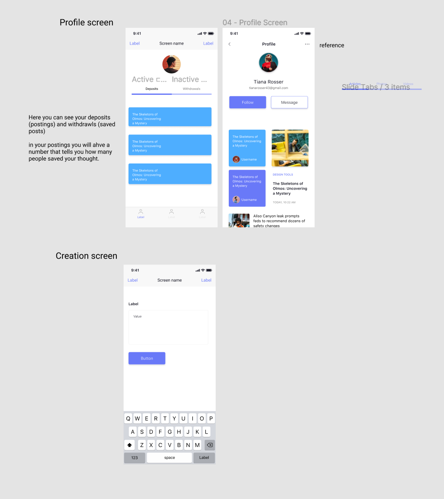

Group 8: ThoughtWell
===

# ThoughtWell

## Table of Contents
1. [Overview](#Overview)
2. [Product Spec](#Product-Spec)
3. [Schema](#Schema)

## Overview
### Description
An application that makes it easy to share thoughts with those in your neighborhood. Create your thoughts, publish them for others to see, and view other people's thoughts. If you enjoyed reading a thought, save it to your "thoughtWallet". See how many other users saved your thought.

### App Evaluation
- **Category:** Localized Social Networking
- **Mobile:** Would work best for mobile, since it is more interesting to be able to post to other communities when you visit them. A desktop application is also feasible, but wouldn't be the best medium for the application. 
- **Story:** Users will be able to get in touch with those around them. Become familiar with the people living in your area by sharing personal or interesting thoughts. 
- **Market:** Only 18+ are expected to use.
- **Habit:** Could be used as often as the user wanted. Not a neccesary app for daily important tasks.
- **Scope:** Location sharing is vital to the app working. Upon first start, the user must enter a thought, any thought. Then they will be able to view what others have posted. 

## Product Spec
### 1. User Stories (Required and Optional)

**Required Must-have Stories**

* User opens app and is shown the front page of all other thought postings 
* User can see how many other people have saved their thought on a separate page
* Thought posting page
* Saved thoughts page

**Optional Nice-to-have Stories**

* Map view of coarse location with other's thoughts
* Users can comment and view other user's comments on thoughts

### 2. Screen Archetypes

* Login/register page
* Thought posting screen
* Thought viewing screen
    * Functions like tinder swipe

* User's submitted thoughts, and saved thoughts
    * one page
 
 
### 3. Navigation

**Tab Navigation** (Tab to Screen)

* See other's thoughts
* Post thought
* Profile

**Flow Navigation** (Screen to Screen)

* Log-in/ Register page -> Post a thought page
* From here user will use tabs to navigate 

## Wireframes
 
 

## Schema 
### Models
#### Thought

   | Property           | Type     | Description                                                                 |
   | ------------------ | -------- | --------------------------------------------------------------------------- |
   | objectID           | String   | unique id for the user thought (default field)                              |
   | text               | String   | body of text for user thought                                               |
   | userID             | String   | Name of user who made the thought                                           |
   | createdAt          | DateTime | date when thought is created (default field) but user should stay anonymous |
   | numSaves           | int      | number of times the thought was saved by others                             |
   | locationOfCreation | String   | the location of where the thought was created                               |
  
  
#### User

   | Property      | Type                      | Description                                                                   |
   | ------------- | ------------------------- | ----------------------------------------------------------------------------- |
   | userID        | String                    | unique id for the user                                                        |
   | userName      | String                    | username of the user                                                          |
   | numDeposits   | int                       | the number of times the user has created (deposited) a thought                |
   | numWithdrawls | int                       | the number of times the user has seen (withdrawn) a thought                   |
   | totalNumSaves | int                       | number of times others have saved the user's thought into their thoughtwallet |
   | deposits      | List of thought objectIDs | list of thoughts that user has created                                        |
   | thoughtWallet | List of thought objectIDs | list of thoughts that user has saved                                          |
  

### Networking
#### List of network requests by screen
   - Home Feed Screen
      - (Read/GET) Query a thought (withdrawing a thought) made by others (GET all thoughts in local area)
      - (Read/GET) Get thoughts that are near user's location
      - (Read/GET) User's current location
      - (Create/POST) Save a thought into their thoughtWallet
      - OPTIONALS:
          - (Create/POST) Create a new comment on a thought
          - (Delete) Delete existing comment
   
   - Create thought screen
      - (Create/POST) Create a new thought object (depositing a thought)
      - (Read/GET) User's current location

   - Profile Screen (thoughtwallet)
      - (Read/GET) Query all of user's submitted thoughts (their deposits)
      - (Read/GET) All thoughts this user has saved (thoughtWallet saves)
      - (Delete) Delete existing deposit (thoughtWallet save)

## Update 
 

